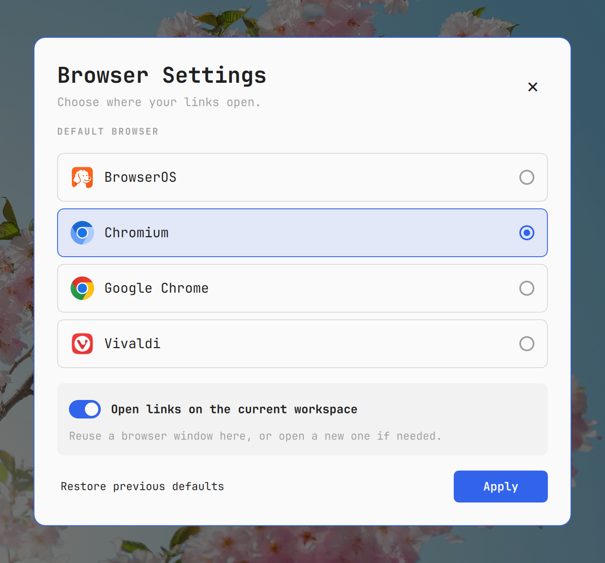

# Browser Settings for Omarchy

Choose your default browser and optionally keep links on the current workspace.

Browser Settings is an Omarchy Quattro settings panel with a small bar button.
The default-browser choice works with installed desktop browsers. For native
Chromium and Google Chrome, **Open links on the current workspace** reuses the
first matching window on the current workspace, or creates a new window there.



[日本語](README.ja.md)

## Install

Requires Omarchy 4 / Quattro with shell plugin support. Omarchy 3's Waybar does
not load this QML plugin.

```bash
omarchy plugin add https://github.com/agata/omarchy-browser-settings.git --enable
```

Click the browser icon in the bar, or open the panel directly:

```bash
omarchy-shell shell summon io.github.agata.browser-settings '{}'
```

1. Select an installed browser.
2. Optionally enable **Open links on the current workspace**.
3. Click **Apply** to change the HTTP, HTTPS and HTML associations for your user.

Installing, enabling, opening or closing the plugin does not change the default
browser. Only **Apply**, **Restore previous defaults**, or their CLI equivalents
change those associations. No root access, package installation or shell restart
is required. Nothing under `/usr/share/omarchy` is modified.

## Behavior

| Preference | What happens |
| --- | --- |
| Workspace option off | The selected browser's original desktop entry becomes the OS default. Its normal behavior applies. |
| Workspace option on, a matching window is here | Focus the first matching window and send the link to that browser. |
| Workspace option on, no matching window is here | Create a new window on the originating workspace. Existing windows elsewhere stay in place. |

The picker reads installed `WebBrowser` desktop applications through GIO. Hidden
entries and this plugin's own routing handler are excluded. Workspace routing is
available only for standard native Chromium / Google Chrome launchers; custom
profile commands, Flatpak browsers, Firefox, Vivaldi and other browsers can still
be selected normally, with the workspace switch disabled.

Regular and named special Hyprland workspaces are supported. With multiple
monitors, the originating application's workspace is used; a browser visible on
another monitor is not considered to be on that workspace.

When workspace mode is enabled, the OS default is a routing desktop entry named
after the selected browser. Clicking **Make default** inside the browser bypasses
the router. The settings panel reads the actual OS associations each time it
opens and will show the option as off. The router passes
`--no-default-browser-check`; it does not edit browser flags or profiles. A browser
already running without that flag may still display its default-browser prompt.

## Independent handler and updates

The QML panel is a settings interface. URL opening runs in a separate process,
without an IPC dependency on `omarchy-shell`:

```text
Application → OS default-browser handler → workspace router → selected browser
                     ↑
              Browser Settings panel
```

On Apply, the backend installs a copy of its runtime into your user data directory.
This keeps links working during a shell restart or after the UI plugin is
disabled or removed. This separation is intentional: removing a settings panel
does not silently change your browser preference.

```bash
omarchy plugin update io.github.agata.browser-settings
```

After an update, open the panel and click **Apply** to update the independent
runtime too. The backend is copied, not symlinked to the plugin checkout.

## Restore and remove

**Restore previous defaults** restores the associations saved before the first
Apply in the current settings session. It only restores types that still have
the plugin's last selection, so subsequent choices in another settings tool are
preserved. Applying again after a restore starts a new saved session.

For complete removal, restore the associations and remove the independent
handler **before** removing the plugin:

```bash
~/.local/bin/omarchy-setup-browser-settings uninstall
omarchy plugin remove io.github.agata.browser-settings
```

If you already removed the UI plugin, the first command still works. If Apply was
never used, there is no installed runtime; just remove the plugin. Saved backup
files remain available under `~/.local/state/omarchy/browser-settings`.

If a previous browser was uninstalled, restore reports the missing application
and leaves the handler installed. Select an available browser in your system
settings, then run uninstall again; it preserves that later selection.

## CLI

From an installed plugin checkout:

```bash
bin/omarchy-setup-browser-settings status
bin/omarchy-setup-browser-settings apply --browser chromium.desktop --workspace
bin/omarchy-setup-browser-settings apply --browser google-chrome.desktop
bin/omarchy-setup-browser-settings restore
```

After Apply, the same commands are available through
`~/.local/bin/omarchy-setup-browser-settings`. Output is JSON. The installed URL
handler also accepts `--new-window`, `--private` / `--incognito`, and multiple URLs
in workspace mode. No-argument launches focus a local window or create one.

## Files and dependencies

| User file | Purpose |
| --- | --- |
| `~/.config/omarchy/browser-settings.json` | Selected browser and workspace preference |
| `~/.config/mimeapps.list` | HTTP, HTTPS and HTML default associations |
| `~/.local/bin/omarchy-{launch,setup}-browser-settings` | Independent launcher and management commands |
| `~/.local/share/omarchy-browser-settings/` | Backend and workspace router |
| `~/.local/share/applications/omarchy-browser-settings-handler.desktop` | Internal XDG handler |
| `~/.local/state/omarchy/browser-settings/` | Original associations, backup and management lock |
| `$XDG_RUNTIME_DIR/omarchy-browser-settings/` | Short-lived request lock |

The XDG config, data and state directory overrides are respected. `~/.local/bin`
must be on PATH, as it is on Omarchy. The plugin checkout lives in
`~/.config/omarchy/plugins/io.github.agata.browser-settings`.

Dependencies: Omarchy Quattro / Quickshell with Qt Quick Controls and Layouts,
Python 3 with PyGObject (`python-gobject` on Arch), `xdg-utils`,
`desktop-file-utils`, Bash, `jq`, `util-linux` (`flock`), Hyprland (`hyprctl`),
systemd's user manager and UWSM (`uwsm-app`). `notify-send` is used for routing
errors when available. These are desktop runtime dependencies; the plugin never
downloads or installs packages on its own.

The backend reads application metadata, MIME defaults and Hyprland's window /
workspace list. It starts the selected browser and may focus a matching window or
move a newly created window. It does not read browser history, cookies, passwords
or page contents, and it does not send telemetry. URLs are passed as arguments,
without shell evaluation. No always-running service is installed.

## Limits of workspace routing

Workspace mode is intended for **one normal profile per browser**. Window class
alone cannot reliably distinguish multiple profiles or incognito windows. Mixing
those windows is not supported. PWA/app windows have different classes and are
not selected. Developer Tools windows are excluded by title.

Chromium does not expose a command-line target window ID. The adapter focuses the
chosen window, checks compositor focus, allows a bounded activation delay, then
opens the URLs. Its own requests are serialized, but rapid manual focus changes
or direct browser launches can still race with delivery. This is a best-effort
workaround, not a change to Chromium's window-selection policy.

New windows are identified by a difference in Hyprland's client list. If several
matching windows appear simultaneously, placement stops with an error instead of
moving an arbitrary window. New-window startup is bounded to approximately ten
seconds. A new window auto-grouped on the wrong workspace is detached before it
is moved, protecting the existing group.

## Development

```bash
omarchy plugin validate .
qmllint -I /usr/share/omarchy/shell Panel.qml BarWidget.qml
/usr/bin/python3 -m unittest discover -s tests -v
```

Tests cover selection, MIME registration and restoration, partial-write failure,
spaces in paths, plugin-independent removal, external preference changes,
workspace reuse/creation, special workspaces, grouping, private/new-window
requests and concurrent URL requests. Tests use temporary user directories;
router tests fake compositor and process-launch commands.

See [TESTING.md](TESTING.md) for the release validation record, including live
Chromium, Google Chrome and OS default-handler checks.

## License

MIT. Copyright © 2026 agata. This is a community plugin, not an official Omarchy
component. Chromium and Google Chrome names and icons belong to their respective
owners; icons shown by the panel come from the locally installed applications.
